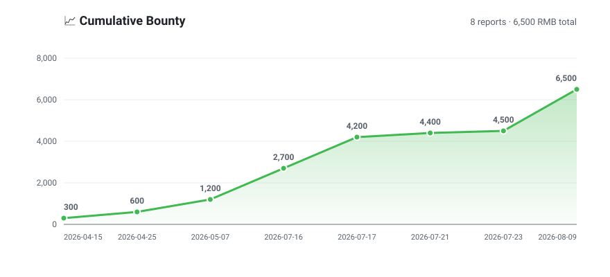
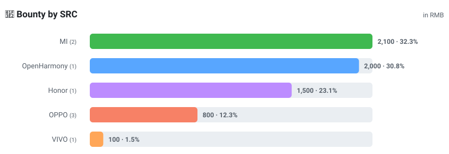

# 🐝 BugBounty

> Our bug bounty hunting archive — every report accounted for 🎯

<!-- BOUNTY:START -->

## 🏆 Bounty Overview

   

<p align="center"></p>

<p align="center"></p>

### 📊 Earnings by SRC

| SRC | Reports | Bounty (RMB) | Share |
|:--- | ---: | ---: | ---: |
| MI | 2 | 2,100 | 32.3% |
| OpenHarmony | 1 | 2,000 | 30.8% |
| Honor | 1 | 1,500 | 23.1% |
| OPPO | 3 | 800 | 12.3% |
| VIVO | 1 | 100 | 1.5% |
| **Total** | **8** | **6,500** | **100%** |

### 📋 All Reports

| # | Date | SRC | Report ID | Bounty (RMB) |
| ---: | --- | --- | --- | ---: |
| 1 | 2026-08-09 | OpenHarmony | `OHSA26-080951547` | 2,000 |
| 2 | 2026-07-23 | VIVO | `0b1d22474841424887ea31215ba1be9d` | 100 |
| 3 | 2026-07-21 | OPPO | `OSRC-2026-2079461171127259136` | 200 |
| 4 | 2026-07-17 | MI | `21904` | 1,500 |
| 5 | 2026-07-16 | Honor | `26406786767923445761754947142` | 1,500 |
| 6 | 2026-05-07 | MI | `20726` | 600 |
| 7 | 2026-04-25 | OPPO | `OSRC-2026-2047955779243347968` | 300 |
| 8 | 2026-04-15 | OPPO | `OSRC-2026-2044355309887164416` | 300 |

<sub>Auto-generated by <code>scripts/update_bounty_readme.py</code> from <code>bounties.csv</code> · Generated on 2026-08-18</sub>

<!-- BOUNTY:END -->

## 📮 How to add a new bounty

Append one line to [`bounties.csv`](bounties.csv) in the format below, then commit and push to `main`:

```csv
date,vendor,report_id,amount_rmb
2026-08-18,MI,22133,500
```

| Field | Description | Example |
|:---|:---|:---|
| `date` | Date the reward was awarded (`YYYY-MM-DD`) | `2026-08-18` |
| `vendor` | Vendor / SRC name | `MI` |
| `report_id` | Report ID, for personal bookkeeping only | `22133` |
| `amount_rmb` | Bounty amount in RMB (plain number) | `500` |

After pushing, [GitHub Actions](.github/workflows/update-bounty-stats.yml) automatically recomputes the stats, redraws both charts and updates this page. You can also regenerate locally:

```bash
python3 scripts/update_bounty_readme.py
```

> Report IDs are kept for personal reconciliation only — no vulnerability details are included.
